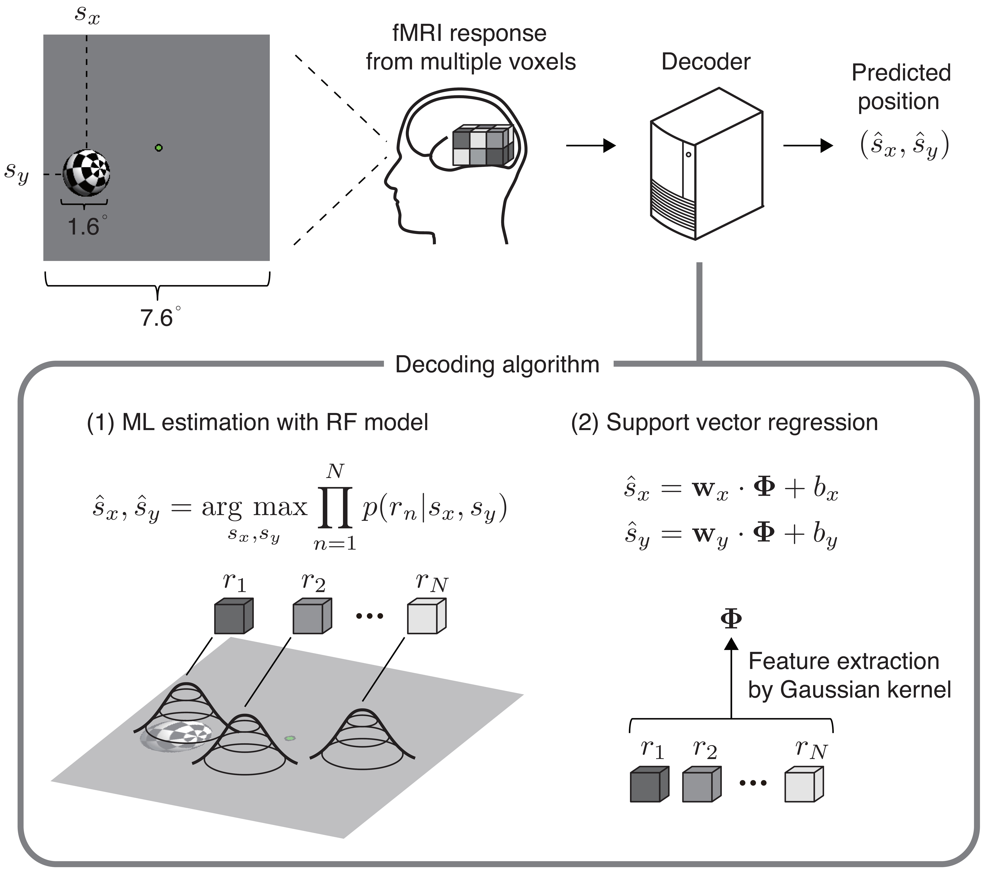

# Position Decoding

This repository contains the demo codes for replicating results in our paper: 
[Majima K, Sukhanov P, Horikawa T, Kamitani Y (2017) "Position information encoded by population activity in hierarchical visual areas". eNeuro (in press).](http://eneuro.org/content/early/2017/03/23/ENEURO.0268-16.2017)

## fMRI data 
The fMRI data for five subjects are avairable from <http://brainliner.jp/data/brainliner/Position_Decoding>. 
Those should be included in the "data" folder.
The fMRI data were saved according to the BrainDecoderToolbox2 format <https://github.com/KamitaniLab/BrainDecoderToolbox2>.

## How to use
In our study, a ball randomly moving in a two dimensional field was presented to human subjects as a stimulus. The stimulus position was predicted (decoded) from brain activity by two decoding algorithms, maximum likelihood estimation (MLE) and support vector regression (SVR). While the first method provides straightforward interpretation given accurate voxel response models, the latter method is expected to perform model-free information retrieval from brain activity data.
### 1. Decoding based on MLE
Please run 
- "exeRFMestimation_XXXXXXXX.m" in the "RFMestimation" folder 
- "exeDecodingWithRFM_XXXXXXXX.m" in the "decodingWithRFM" folder

in this order. The results (true and decoded stimulus positions) would be stored in the "results" folder in the decodingWithRFM folder. Then, please run 
- "makeFigDecodingAccuracyWithRFM_XXXXXXXX.m". 

The results figure would be created. 
### 2. Decoding based on SVR
Please run 
- "exeDecodingWithSVR_XXXXXXXX.m" in the "decodingWithSVR" folder
- "makeFigDecodingAccuracyWithSVR_XXXXXXXX.m"

in this order.
The decoding results would be stored in the "results" folder, and the results figure would be created.
## Copyright and License

Copyright (c) 2017 ATR Department of Neuroinformatics

The scripts provided here are released under the MIT license (<http://opensource.org/licenses/mit-license.php>).

## Contact
Please contact us (kamitanilab.contact@gmail.com) if you have any questions.
